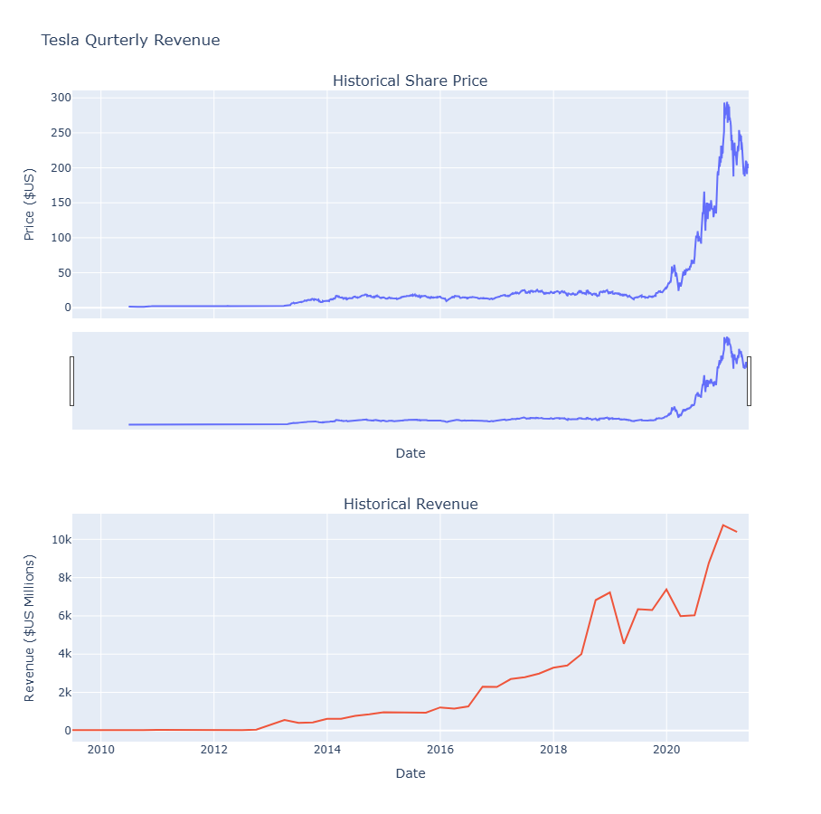

# 📈 Stock Visualization Project

This project demonstrates how to extract, clean, and visualize stock and revenue data for companies like **Tesla** and **GameStop** using Python.

## 🚀 Project Overview
- Fetch stock price data using the `yfinance` library
- Scrape revenue data from online sources using `requests` and `BeautifulSoup`
- Clean and merge datasets using `pandas`
- Create interactive visualizations with `Plotly`

## 📊 Technologies Used
- Python
- Jupyter Notebook
- pandas
- yfinance
- requests
- BeautifulSoup (bs4)
- Plotly

## 📂 Project Structure

```
stock-visualization-project/
├── stock_analysis.ipynb       # Cleaned notebook for portfolio use
├── README.md                  # This file
├── requirements.txt           # Libraries used in this project
├── screenshots/               # Optional plots and charts as images
│   └── tesla_plot.png         # Example output visualization
```


---

## 🖼 Sample Output
 


---

## 🧠 Credit

This project was originally inspired by a lab in the [IBM Data Science Professional Certificate](https://coursera.org/professional-certificates/ibm-data-science). The notebook was modified, cleaned, and customized for portfolio demonstration purposes.

---

## 🛠 How to Run It

Clone the repo and install the requirements:
```bash
pip install -r requirements.txt
```

Then run the notebook:
```bash
jupyter notebook stock_analysis.ipynb
```

---

[](https://nbviewer.org/github/Kash-cyber/stock-visualization-project/blob/main/stock_analysis.ipynb)

## 🔗 Let's Connect!

Hey there! 👋  
Thanks for checking out my project. I'd love to connect and chat about data science, projects, or anything tech!

[](https://www.linkedin.com/in/kashaf-malik-738689304)  
[](https://github.com/Kash-cyber)  
✉️ **Email:** [kashafqaiser1707@gmail.com](mailto:kashafqaiser1707@gmail.com)

